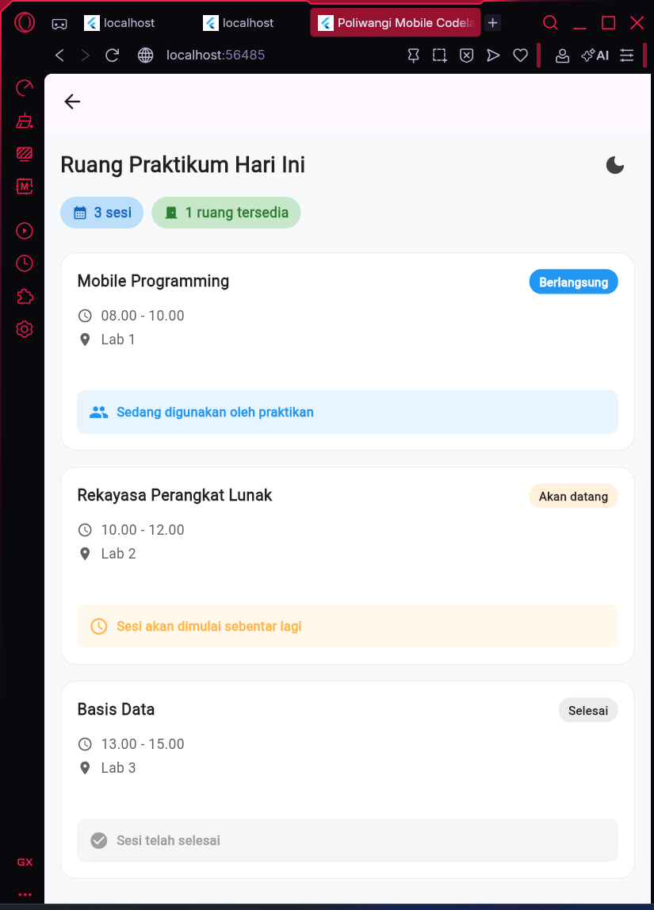
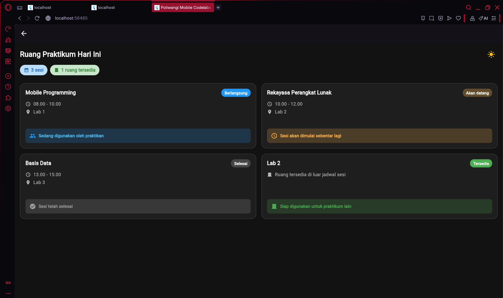
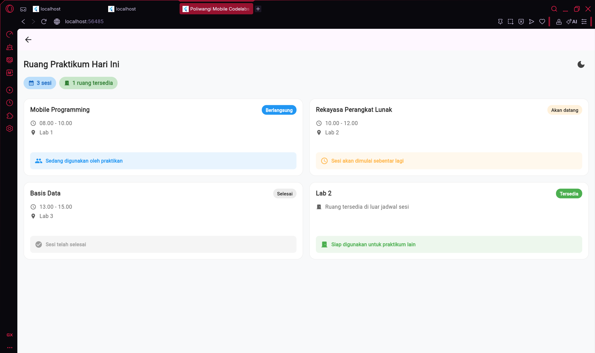

# Laporan Praktikum Modul 02: Declarative UI & Responsive Layout

- **Nama**: Muhammad Bayu Wisnu Syahputra
- **NIM**: 362558302019
- **Kelas / Prodi**: 2D / Sarjana Terapan TRPL
- **Mata Kuliah**: Pemrograman Perangkat Bergerak (Semester 3)

---

## 1. Ringkasan Implementasi

Pada praktikum ini, saya merancang dua layar utama: **Dashboard Akademik TRPL** dan **Ruang Praktikum Hari Ini**. Keduanya mengimplementasikan prinsip *declarative UI* dan *responsive layout* sesuai ketentuan Modul 02.

- **LayoutBuilder** digunakan untuk mendeteksi lebar layar. Breakpoint **600dp** memisahkan layout portrait (satu kolom `ListView`) dan landscape/tablet (dua kolom dengan `Row` + `GridView`). Di `AcademicDashboardScreen`, layout lebar menampilkan `HeaderBanner` di kiri dan daftar mata kuliah di kanan. Di `ruangpraktikum`, `LayoutBuilder` menentukan `crossAxisCount` (1 atau 2) pada `GridView.builder`[reference:0].
- **Filter kategori** dibuat dengan `Wrap` dan `ChoiceChip` di `_buildCategoryFilter()`. Pengguna dapat memilih "Semua", "Teori", atau "Praktikum", lalu daftar `Course` difilter secara dinamis.
- **Stack & Positioned** dipakai pada `CourseCard` (dashboard) untuk menempatkan **badge SKS** di pojok kanan atas kartu, sehingga informasi tetap terlihat tanpa mengganggu konten utama[reference:1].
- **Tema Material 3** diterapkan melalui `ThemeData` dengan `ColorScheme.fromSeed(seedColor: Color(0xFF0284C7))`. Mode gelap/terang dapat di-toggle dari AppBar. Tema di `main.dart` menjadi dasar, sedangkan tiap layar memiliki `Theme` lokal untuk mendukung toggle dark mode secara mandiri.

## 2. Bukti Tangkapan Layar (Running App)

| Mode Portrait (Light) | Mode Dark Theme | Mode Landscape / Tablet (2 Kolom) |
|---|---|---|
|  |  |  |

> *Catatan: Minimal 3 screenshot bukti running dengan viewport berbeda (360dp, 700dp, 1000dp) dan light/dark mode*[reference:2]. Ganti gambar di atas dengan tangkapan layar aplikasi Anda.

## 3. Kendala Layout yang Dihadapi & Solusinya

- **Kendala**: Nama mata kuliah yang panjang, misalnya "Metode dan Model Pengembangan Perangkat Lunak", menyebabkan teks meluber atau terpotong tidak rapi pada `CourseCard`, terutama di layout sempit.
- **Solusi**: Membungkus `Text` dengan `Expanded` dan menambahkan `maxLines: 2` serta `TextOverflow.ellipsis`. Untuk kartu di `ruangpraktikum`, saya juga mengatur `mainAxisExtent` pada `GridView` agar tinggi kartu konsisten dan tidak terjadi overflow[reference:3].

## 4. Jawaban Pertanyaan Refleksi

1. **Efisiensi Single-pass BoxConstraints**  
   Aturan *"Constraints go down, Sizes go up, Parent sets position"* membuat Flutter melakukan komputasi layout hanya **satu kali** per frame. `LayoutBuilder` menerima `BoxConstraints` dari parent dan membangun ulang widget berdasarkan constraints tersebut. Karena setiap widget hanya menerima constraints dari parent-nya dan mengembalikan ukuran ke parent, tidak ada pengukuran berulang atau negosiasi dua arah. Hasilnya, kompleksitas layout menjadi **O(N)** — linear terhadap jumlah widget — sehingga rendering sangat efisien bahkan pada widget tree yang dalam[reference:4].

2. **Kriteria Modularisasi Widget**  
   Sebuah widget sebaiknya **dipecah menjadi file terpisah** (seperti `CourseCard`) ketika: (a) digunakan ulang di lebih dari satu layar, (b) memiliki tanggung jawab yang jelas dan mandiri, (c) cukup kompleks sehingga mengotori file utama, dan (d) perlu diuji secara terpisah. Sebaliknya, **cukup sebagai private widget** di file yang sama (misalnya `_StatPill`, `_ModuleCard`, `_LockedModuleCard`) jika hanya dipakai di satu layar, masih terkait erat dengan logika layar tersebut, dan tidak memerlukan pengujian terpisah. Modularisasi mengurangi duplikasi kode dan mempermudah pemeliharaan[reference:5].

3. **Manfaat M3 ThemeData Terpusat**  
   Penggunaan tema terpusat (`ThemeData` Material 3) dengan `ColorScheme.fromSeed` memberikan **konsistensi visual** di seluruh aplikasi. Perubahan tema global (misalnya warna seed, tipografi, atau bentuk komponen) cukup dilakukan di **satu tempat**. Dukungan light/dark mode menjadi lebih mudah karena `ColorScheme` secara otomatis menghasilkan palet warna yang sesuai. Selain itu, pengembangan UI menjadi lebih cepat karena komponen M3 sudah memiliki style bawaan yang selaras, dan aksesibilitas tetap terjaga. Untuk aplikasi skala besar, pendekatan ini menghindari hardcode warna di setiap widget dan mempermudah rebranding[reference:6].